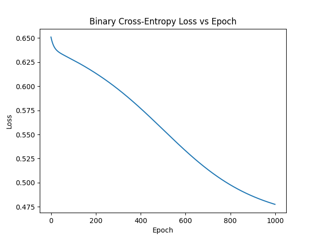
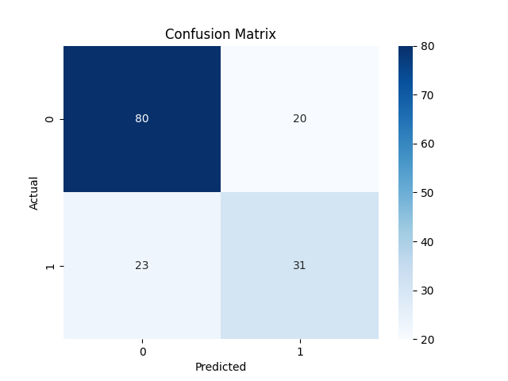

# Sinir Ağı ile Diyabet Tahmini (İleri & Geri Yayılım)
---
> Bu ödevde, Pima Indian kadınlarına ait ölçümlerle diyabet riskini **sıfırdan yazılmış** bir ileri-geri yayılımlı sinir ağı kullanarak tahmin ettik. Kodun tamamı NumPy üzerinde; yani TensorFlow / PyTorch gibi kütüphanelere hiç ihtiyacımız olmadı.

## İçindekiler
- [Problemin Arka Planı](#problemin-arka-planı)
- [Veri Seti](#veri-seti)
- [Yöntem](#yöntem)
- [Sonuçlar](#sonuçlar)
- [Tartışma](#tartışma)
- [Projeyi Çalıştırma](#projeyi-çalıştırma)
- [Dosya Açıklamaları](#dosya-açıklamaları)
- [Kaynakça](#kaynakça)
- [Yazar](#yazar)


## Veri Seti
Pima Indians Diabetes veri seti (768 örnek) — Kaggle üzerinde açık olarak paylaşılıyor. Aşağıdaki sütunlar bulunuyor:

| Özellik | Açıklama |  |
|---|---|---|
| Pregnancies | Gebelik sayısı |  |
| Glucose | Plazma glukozu |  |
| BloodPressure | Diyastolik kan basıncı (mm Hg) |  |
| SkinThickness | Triseps deri kalınlığı (mm) |  |
| Insulin | 2 saatlik serum insülini (µU/ml) |  |
| BMI | Vücut kitle indeksi |  |
| DiabetesPedigreeFunction | Ailevi diyabet fonksiyonu |  |
| Age | Yaş |  |
| Outcome | Hedef değişken (0 = sağlıklı, 1 = diyabet) |  |

Eksik veri görünmeyen sütunlarda “0” değeri aslında eksikliği temsil ediyor; bu nedenle Glucose, BloodPressure, SkinThickness, Insulin ve BMI alanlarındaki sıfırları medyan değerle değiştirdik. Sonrasında veri **%80 eğitim / %20 test** olarak stratified biçimde bölündü.

## Yöntem
1. **Ön İşleme `preprocess.py`**  
   • Veri setini indirir → temizler → `data/` klasörüne CSV’ler olarak yazar.
2. **Model `neural_network.py`**  
   • Katman yapısı: `8 → 16 → 8 → 1`  
   • Aktivasyon: Sigmoid  
   • Kaybı: Binary Cross-Entropy  
   • Ağırlık Başlatma: Xavier (Glorot)  
   • Optimizasyon: Tam gradyan iniş (η = 0.05, 1000 epoch)
3. **Eğitim & Değerlendirme `train.py`**  
   • Özellikleri `StandardScaler` ile ölçekler  
   • Kayıp-epoch grafiği ve karışıklık matrisi PNG olarak kaydeder  
   • Doğruluk, precision, recall vs. `metrics.json` içinde saklanır.

## Sonuçlar


| Metrik | Değer |
|---|---|
| Doğruluk | **%72** |



## Tartışma
Modelimizi tamamen el emeği kodla eğittiğimiz için %72 doğruluk gayet cesaret verici. Daha iyi sonuçlar için:
- Mini-batch veya Adam optimizasyonu
- Düzenlileştirme (L2, Dropout)
- Katman / nöron sayısı ve öğrenme oranı araması yapılabilir.

Unutmayalım: Tıbbi alanda **yanlış negatif** (hastalığı atlamak) çok pahalıdır; bu yüzden hassasiyet (recall) metriği özellikle kritik.

## Projeyi Çalıştırma
```bash
# 1) Veri indirme & temizleme
python preprocess.py

# 2) Modeli eğit
python train.py
```
Komutlardan sonra `data/` klasöründe tüm görseller ve metrik dosyası oluşacaktır.

## Dosya Açıklamaları
| Dosya | Ne İşe Yarar? |
|---|---|
| `preprocess.py` | Veri setini indirir, temizler, eğitim/test CSV’lerini oluşturur |
| `neural_network.py` | NumPy tabanlı ileri-geri yayılımlı sinir ağı |
| `train.py` | Eğitimi yürütür, grafik ve metrikleri kaydeder |
| `data/` | Tüm çıktı dosyaları (CSV, PNG, JSON) |

## Kaynakça
- Pima Indians Diabetes Database – Kaggle
- Goodfellow, Bengio & Courville. *Deep Learning* (Bölüm 6)
- NumPy, Pandas ve Matplotlib Belgeleri

## Yazar
Mustafa Surhay Samsa  
Ankara Üniversitesi – Yapay Zeka ve Veri Mühendisliği

---


---

#